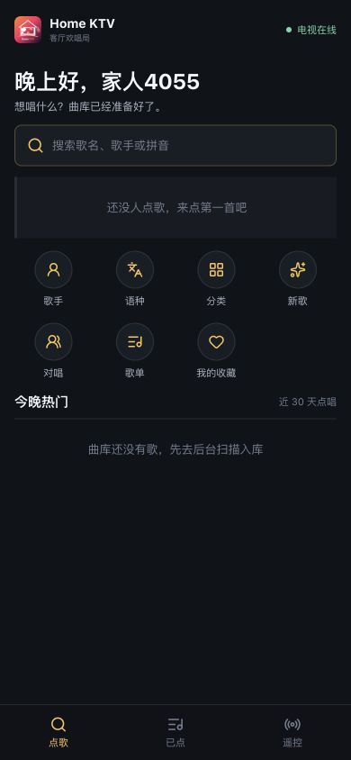
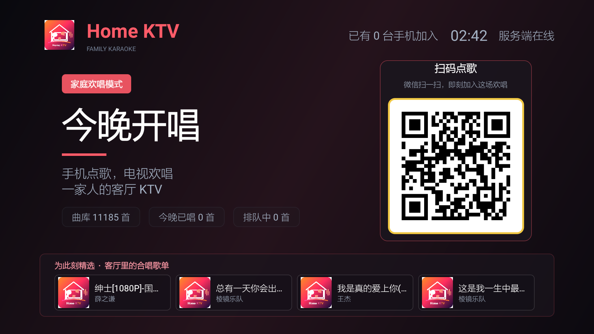
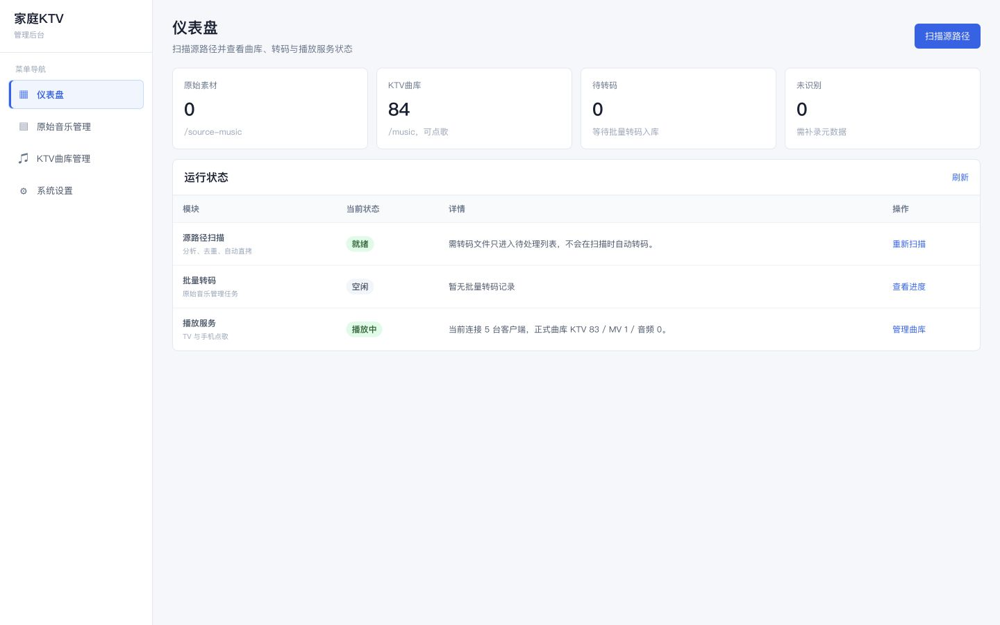

# Home KTV

**中文** | [English](README_EN.md)

## 截图

| 手机点歌端 | 电视播放端 | 曲库与服务仪表盘 |
| --- | --- | --- |
|  |  |  |
| 在手机上浏览、搜索、收藏和点歌。 | 大屏播放、动态歌词与微信扫码点歌。 | 统一查看曲库、转码任务和播放服务状态。 |

Home KTV 是一套运行在家庭 NAS 或 Linux 主机上的局域网点歌系统。电视负责播放，手机通过微信扫码进入点歌页，服务端管理曲库、队列、歌词、播放记录和系统设置。

系统由三个客户端组成：

- **服务端**：Spring Boot、PostgreSQL、FFmpeg/FFprobe、WebSocket
- **手机端**：Vue 3 H5 点歌页和管理后台，无需安装 App
- **电视端**：Android TV 客户端，基于 Media3/ExoPlayer

> 项目面向可信家庭局域网，未提供公网登录和安全防护，请勿直接暴露到互联网。

## 主要功能

### 手机点歌与遥控

- 微信或浏览器扫码进入，无需注册
- 支持歌名、歌手、中文、全拼和拼音首字母搜索
- 点歌、顶歌、删除自己的歌曲、智能打散和多人队列
- 播放、暂停、重唱、切歌、音量及原唱/伴唱切换
- 收藏、最近演唱、一键再唱、热门榜单和公开歌单
- 逐行 LRC 与增强 LRC 逐字歌词
- 鼓掌、欢呼、倒彩、干杯等现场音效

### Android TV 播放

- 播放 MP4、MKV、MPEG、MP3、FLAC 等常见媒体
- 支持 MPEG-2、MP2 和双音轨 KTV 视频
- 原唱/伴奏无重新加载切换
- 当前句与下一句双行歌词，当前句连续扫色高亮
- 遥控器控制播放、队列、音量和原伴唱
- 断线重连、状态恢复、待机轮播和防烧屏微移
- 播放页显示“微信扫码点歌”二维码
- 支持 Android 8.0（API 26）及以上版本

### 曲库管理

- 原始素材分析、MD5 去重、自动直拷和批量转码
- 使用 FFprobe 识别容器、编码、时长、分辨率和音轨
- 自动读取媒体标签、封面及同名歌词侧车文件
- 识别 KTV 视频、普通 MV 和纯音频
- 音轨标记纠正、歌曲编辑、重新解析及失效文件处理
- AI 辅助分类、主题歌单和点唱统计
- PostgreSQL 持久化及数据库备份/恢复

## 系统结构

```text
手机浏览器 / 微信
        │ HTTP + WebSocket
        ▼
Home KTV 服务端 ───── PostgreSQL
        │
        ├── /source-music  原始素材目录
        ├── /music         可点播曲库目录
        │
        └── Android TV     视频、音轨、歌词和控制
```

服务端默认使用以下入口：

| 用途 | 地址 |
| --- | --- |
| 手机点歌 | `http://<主机IP>:8080/m` |
| 管理后台 | `http://<主机IP>:8080/m/admin` |
| 健康检查 | `http://<主机IP>:8080/api/health` |

## 快速开始

### 环境要求

- 支持 Docker Compose 的 NAS、Linux 主机或 Docker Desktop
- 建议至少 1 GB 可用内存
- 手机、Android TV 和服务端位于同一局域网
- Android TV 8.0（API 26）或更高版本

### 1. 配置目录和密码

```bash
git clone <仓库地址>
cd home-ktv
cp .env.example .env
```

编辑 `.env`，至少确认以下配置：

```dotenv
KTV_SOURCE_MUSIC_DIR=/volume1/home-ktv/source-music
KTV_MUSIC_DIR=/volume1/home-ktv/music
KTV_DB_PASSWORD=请替换为强密码
```

- `KTV_SOURCE_MUSIC_DIR`：放置未经处理的原始视频和音频。
- `KTV_MUSIC_DIR`：存放已直拷或转码完成、可以点播的文件。

两个目录不要配置成同一路径。服务端会向曲库目录写入处理结果，请确保容器具有写权限。

### 2. 启动服务

推荐直接拉取 GitHub Actions 发布的多架构镜像，无需在 NAS 或主机上编译：

```bash
docker compose -f docker-compose.prebuilt.yml up -d --pull always --wait
```

默认使用 `ghcr.io/zhayinggang/ktv-home:latest`。生产环境可在 `.env` 中将
`KTV_RELEASE_IMAGE` 设置为具体的发布标签，以避免 `latest` 自动变化。

需要从源码构建时使用：

```bash
docker compose up -d --build --wait
```

确认容器健康：

```bash
docker compose ps
curl http://127.0.0.1:${KTV_HTTP_PORT:-8080}/api/health
```

默认开放：

- TCP `8080`：H5、管理后台、API、WebSocket 和媒体流
- UDP `18888`：Android TV 局域网自动发现

NAS 防火墙需要允许这两个端口；使用自定义端口时以 `.env` 为准。

### 3. 导入歌曲

1. 把原始歌曲放入 `KTV_SOURCE_MUSIC_DIR`。
2. 打开 `http://<主机IP>:8080/m/admin`。
3. 在仪表盘执行“扫描源路径”。
4. 兼容文件会自动直拷到曲库；不兼容文件进入待转码列表。
5. 在“原始音乐管理”中执行单首、选中或批量转码。
6. 在“KTV 曲库”中检查歌名、歌手、媒体类型和原唱/伴奏音轨。

扫描只负责分析、去重和直拷，不会自动启动耗时转码。批量转码进度可在管理后台查看，任务运行时支持把指定歌曲插到下一首处理。

源目录自动监听默认关闭。是否启用请在管理后台“系统设置”中的“源目录自动扫描”开关调整；关闭时只有手动点击“扫描源路径”才会扫描，不通过 Compose 或环境变量配置。

确认入库结果后，可点击批量转码按钮右侧的“自动清理”释放原始素材目录空间。系统只会删除已成功入库、关联曲库记录有效且曲库输出文件真实存在的源文件；待转码、失败、重复、未识别、曲库文件缺失或路径校验不通过的素材会保留。转码任务运行期间不能执行自动清理。

### 4. 安装 Android TV 客户端

本地构建 Debug APK 需要 JDK 17 和 Android SDK：

```bash
cd android-tv
./gradlew testDebugUnitTest assembleDebug
```

APK 输出位置：

```text
android-tv/app/build/outputs/apk/debug/app-debug.apk
```

通过 ADB 安装：

```bash
adb connect <TV_IP>:5555
adb install -r android-tv/app/build/outputs/apk/debug/app-debug.apk
```

也可以通过 U 盘或电视文件管理器安装。首次启动会尝试自动发现服务端；发现失败时填写 `<主机IP>:8080`。部分电视盒子需要额外允许未知来源、自启动和后台运行。

### 5. 开始点歌

TV 连接成功后会显示二维码。手机使用微信扫码进入点歌页，选择歌曲后电视自动播放；队列、播放状态、歌词和遥控操作通过 WebSocket 实时同步。

## 媒体与歌词

### 文件命名

系统优先读取媒体标签，标签缺失时从文件名推断歌手和歌名。推荐格式：

```text
歌手 - 歌名.mp4
歌手 - 歌名.mkv
歌手 - 歌名.mp3
```

示例：

```text
source-music/
├── 周杰伦 - 晴天.mp4
├── S.H.E - Super Star.mpg
└── Beyond - 海阔天空.mkv
```

同一首歌存在多个版本时，双音轨 KTV 视频优先于普通 MV 和纯音频。

### 双音轨约定

推荐的视频音轨顺序：

1. 原唱
2. 伴奏

同时建议写入音轨标题 `原唱`、`伴奏` 和语言标签 `zho`。系统会自动判断伴奏轨；识别错误时可在手机遥控页纠正并保存。

仓库提供一个基础声道相减脚本，可为满足声道条件的立体声 MV 生成双音轨文件：

```bash
./scripts/make_ktv_mv.sh input.mp4 output.mp4
```

该脚本不是 AI 人声分离，效果取决于原音频的声道混音方式，不能替代官方伴奏或专业分轨。

### 歌词侧车文件

歌词文件与媒体同名并放在同一目录：

```text
周杰伦 - 晴天.mp4
周杰伦 - 晴天.lrc
```

支持普通逐行 LRC：

```text
[00:12.50]故事的小黄花
```

支持增强 LRC 逐字时间：

```text
[00:12.50]<00:12.50>故<00:12.80>事<00:13.10>的<00:13.35>小<00:13.60>黄<00:13.90>花
```

增强 LRC 会在 TV 上以整句连续扫色显示，手机歌词页也会按字同步。

## 配置参考

常用环境变量：

| 变量 | 默认值 | 说明 |
| --- | --- | --- |
| `KTV_SOURCE_MUSIC_DIR` | `./source-music` | 宿主机原始素材目录 |
| `KTV_MUSIC_DIR` | `./music` | 宿主机可点播曲库目录 |
| `KTV_DATA_DIR` | `./data` | 宿主机应用数据目录 |
| `KTV_PG_DIR` | `./postgres` | 宿主机 PostgreSQL 数据目录 |
| `KTV_HTTP_PORT` | `8080` | Web、API、WebSocket 和媒体流端口 |
| `KTV_DISCOVERY_UDP_PORT` | `18888` | TV 自动发现 UDP 端口 |
| `KTV_DISCOVERY_NAME` | `家庭KTV` | TV 发现列表中的名称 |
| `KTV_DB_NAME` | `ktv` | PostgreSQL 数据库名 |
| `KTV_DB_USER` | `ktv` | PostgreSQL 用户名 |
| `KTV_DB_PASSWORD` | `ktv` | PostgreSQL 密码，正式部署必须修改 |
| `KTV_IMAGE_REGISTRY` | `docker.m.daocloud.io` | Docker 基础镜像仓库前缀 |
| `KTV_APP_IMAGE` | `home-ktv:latest` | 应用镜像名称 |
| `KTV_RELEASE_IMAGE` | `ghcr.io/zhayinggang/ktv-home:latest` | 预编译 Compose 使用的 GitHub 容器镜像 |
| `JAVA_TOOL_OPTIONS` | `-XX:MaxRAMPercentage=70 -Xmx512m` | 容器 JVM 内存参数 |

二维码默认使用 TV 访问服务端时的局域网 Host 地址。若网络中存在反向代理或多个网卡，可在管理后台设置“展示地址”，例如 `192.168.1.10:8080`。

## 硬件转码

默认使用 CPU 转码。Linux 主机可通过以下方式透传 VAAPI 设备：

> **验证范围：**目前只在 Intel 核显上验证了 VAAPI H.264 / HEVC 硬件编码，
> 使用 Intel `iHD` 驱动。AMD VAAPI 和 Rockchip RK MPP 尚未经过实机验证，
> 相关 Compose 配置仅表示支持设备透传，不保证预编译镜像可以直接启用硬件编码。

```bash
docker compose \
  -f docker-compose.yml \
  -f docker-compose.hardware.yml \
  up -d --build --wait
```

宿主机需要提供 `/dev/dri`。Intel 设备还需要容器内存在 `iHD_drv_video.so`；
官方预编译的 AMD64 镜像会安装 `intel-media-driver`。启动后在管理后台“系统设置”
中检测并开启硬件加速；设备、驱动、权限或编码器不可用时系统会拒绝保存。

瑞芯微设备可使用：

```bash
docker compose \
  -f docker-compose.yml \
  -f docker-compose.rockchip.yml \
  up -d --build --wait
```

宿主机需要提供 `/dev/mpp_service`，并且 FFmpeg 必须包含对应的 RK MPP 编码器。通用镜像不保证包含 `h264_rkmpp` 或 `hevc_rkmpp`。

## AI 分类

AI 分类默认关闭，不影响扫描、点歌和播放。启用兼容接口：

```dotenv
KTV_AI_ENABLED=true
KTV_AI_BASE_URL=https://api.deepseek.com
KTV_AI_API_KEY=你的密钥
KTV_AI_MODEL=deepseek-v4-flash
KTV_AI_AUTO_APPLY_CONFIDENCE=0.90
```

修改 `.env` 后重新部署：

```bash
docker compose up -d --build
```

密钥只应保存在本地 `.env` 或受控 Secret 中，不要提交到仓库。

## 日常运维

### 更新

```bash
git pull
docker compose up -d --build --wait
```

### 停止与启动

```bash
docker compose stop
docker compose start
```

移除容器但保留数据卷：

```bash
docker compose down
```

不要在需要保留数据时运行 `docker compose down -v`。

### 日志

```bash
docker compose logs -f ktv
docker compose logs -f db
```

### 备份与恢复

```bash
./scripts/backup.sh /volume1/backup/home-ktv
```

恢复指定备份：

```bash
./scripts/restore.sh \
  /volume1/backup/home-ktv/home-ktv-YYYYMMDD-HHMMSS.dump \
  --yes
```

数据库备份包含歌曲元数据、设置、歌单、队列和播放历史，不包含原始媒体文件。`source-music` 和 `music` 目录需要使用 NAS 自身的备份方案。

## 本地开发

开发环境需要 Node.js 20+、JDK 21、JDK 17、Docker 和 Android SDK。

```bash
# PostgreSQL
docker compose -f docker-compose.dev.yml up -d

# 后端，JDK 21
cd backend
./mvnw spring-boot:run

# H5
cd h5
npm install
npm run dev

# Android TV，JDK 17
cd android-tv
./gradlew testDebugUnitTest assembleDebug
```

测试命令：

```bash
cd backend && ./mvnw test
cd h5 && npm test
cd android-tv && ./gradlew testDebugUnitTest
```

目录结构：

```text
backend/      Spring Boot 服务端、数据库、扫描、转码和实时控制
h5/           Vue 3 手机点歌端与管理后台
android-tv/   Kotlin Android TV 客户端
scripts/      备份、恢复和媒体辅助脚本
```

## 常见问题

### 手机扫码后打不开

- 确认手机和服务端在同一局域网。
- 确认二维码地址不是 Docker 的 `172.x` 容器地址。
- 在管理后台设置正确的“展示地址”。
- 检查 NAS 防火墙和 TCP 端口。

### TV 自动发现不到服务端

- 检查 UDP `18888` 是否放行。
- 确认路由器没有开启 AP 隔离或访客网络隔离。
- 在 TV 首次设置页手动输入 `<主机IP>:8080`。

### 原唱和伴奏相反

在手机遥控页点击“原唱和伴唱弄反了？”，系统会纠正当前文件的伴奏轨标记并保存。

### 视频无法播放或卡顿

- 在原始音乐管理中查看格式分析结果。
- 对不兼容文件执行转码。
- 检查 NAS CPU、磁盘和网络占用。
- Linux 主机可尝试启用 VAAPI 或 RK MPP 硬件转码。

### 歌词未显示

- 确认 LRC 与媒体文件基础名称完全相同。
- 检查时间标签格式是否为 `[mm:ss.xx]`。
- 修改歌词后重新扫描，系统支持同名侧车歌词更新。

## 已知限制

- 系统只适用于可信局域网，不应直接暴露到公网。
- AI 人声分离或声道相减生成的伴奏可能残留主唱，无法达到官方母带效果。
- 蓝牙麦克风延迟和音质取决于电视盒子固件，实时演唱优先使用 USB 或有线设备。
- 不同 KTV 视频的音轨顺序并不统一，首次导入后建议抽查。
- Android TV 自启动和后台保活可能需要盒子厂商的额外权限。

## 许可与媒体责任

项目代码采用 [MIT License](LICENSE)，允许自由使用、修改、分发和商业使用，但需保留许可证及版权声明。

请只导入和播放自己有权使用的媒体。Home KTV 不提供、下载或分发歌曲、MV 或伴奏资源。

问题反馈请附上 NAS 系统、Android TV 型号、Android 版本、媒体格式和相关日志，并删除 IP、密码、密钥等隐私信息。
